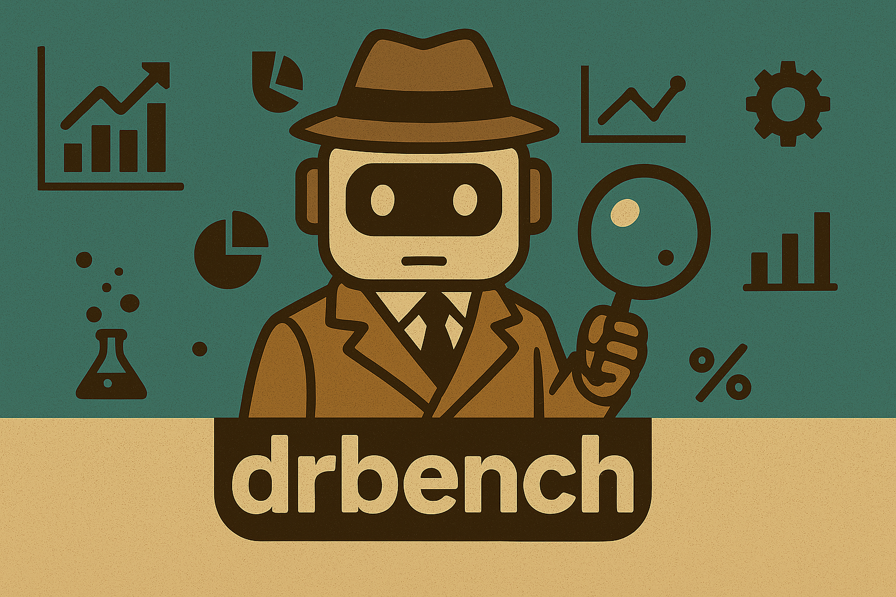

# DrBench Enterprise Research Benchmark





[](https://arxiv.org/abs/2510.00172) [](https://discord.gg/9rQ6HgBbkd)

**`DRBench`** is the first of its kind benchmark designed to evaluate deep research agents on complex, open-ended **enterprise deep research tasks**.

It tests an agent’s ability to conduct **multi-hop, insight-driven research** across public and private data sources,just like a real enterprise analyst.


## Data Overview

The benchmark data is included in `drbench/data/`:

- **DR Questions**: [DR Questions CSV](drbench/data/summary/dr_questions.csv)
- **Facts**: [Facts Directory](drbench/data/summary/facts/)
- **Tasks**: Complete task configurations in `drbench/data/tasks/` with enterprise files

**Alternative Data Source**: The dataset is also available on HuggingFace at [ServiceNow/drbench](https://huggingface.co/datasets/ServiceNow/drbench) for browsing task metadata and using with the `DRBENCH_DATA_DIR` environment variable.

## Quick Start

### Install Requirements

```bash
uv pip install -e .
```

**Custom Data Directory:** By default, the library uses data from `drbench/data/`. To use a custom data location (e.g., cloned from HuggingFace), set the `DRBENCH_DATA_DIR` environment variable:
```bash
export DRBENCH_DATA_DIR=/path/to/custom/data
```

### (1) Quick Run (Without Docker) 

```
python minimal_local.py 
```

This loads task SANITY0, generates a basic report and saves the results under `results/minimal_local`

### (2) Quick Run (With Docker) 


### Install Docker (https://www.docker.com/get-started/)
```
cd services
make local-build
```
this takes around 30 minutes and only has to be done once

### Run agent on Docker Environment

```
python minimal.py 
```

This loads task DR0001, generates a basic report and saves the results under `results/minimal`


### (3) Test Your Own Agent

Build and evaluate your own research agent in just 4 steps!

#### (a) Load a Task

First, pick a task to work with:

```python
from drbench import task_loader
task = task_loader.get_task_from_id("DR0001")
```

See what the task is about:

```python
print(task.summary())
print(task.get_dr_question())
```

#### (b) Create Your Agent

Your agent needs a `generate_report` method that returns a report with structured insights:

```python
class MyAgent:
    def generate_report(self, query, env):
        # Your research logic here
        # 1. Search across files, emails, chats, and web
        # 2. Extract insights with supporting citations
        # 3. Synthesize into a comprehensive report

        insights = [
            {
                "claim": "Key finding from your research",
                "citations": ["file.pdf", "https://example.com"]
            },
            # ... more insights
        ]

        return {
            "report_insights": insights,  # List of claim-citation pairs
            "report_text": report_text     # Full report as string
        }
```

Refer to `BasicAgent` for a simple example in `drbench/agents/basic_agent.py`

Or use the full `DrBenchAgent` in `drbench/agents/drbench_agent/drbench_agent.py`:

#### (d) Evaluate Your Report

See how well your agent did:

```python
from drbench.score_report import score_report
scores = score_report(
    predicted_report=report,
    task=task,
    savedir="my_results"
)

print(f"Insights Recall: {scores['insights_recall']:.3f}")
```

---

## 🧠 Why `drbench`?

- **🔎 Real Deep Research Tasks**  
  Not simple fact lookups. It has tasks like _"What changes should we make to our product roadmap to ensure compliance?"_ which require multi-step reasoning, synthesis, and reporting.

- **🏢 Enterprise Context Grounding**  
  Each task is rooted in realistic **user personas** (e.g., Product Developer) and **organizational settings** (e.g., ServiceNow), for deep understanding and contextual awareness.

- **🧩 Multi-Modal, Multi-Source Reasoning**  
  Agents must search, retrieve, and reason across:
  - Internal chat logs 💬  
  - Cloud file systems 📂  
  - Spreadsheets 📊  
  - PDFs 📄  
  - Websites 🌐  
  - Emails 📧

- **🧠 Insight-Centric Evaluation**  
  Reports are scored based on whether agents extract the **most critical insights** and **properly cite** their sources.

---

## 📦 What You have

✅ The **first benchmark** for deep research across hybrid enterprise environments  
✅ A suite of **real-world tasks** across Enterprise UseCases like CRM
✅ A **realistic simulated enterprise stack** (chat, docs, email, web, etc.)  
✅ A task generation framework blending **web-based facts** and **local context**  
✅ A **lightweight, scalable evaluation mechanism** for insightfulness and citation


---

## 🤝 Get Involved

Interested in early access, collaboration, or feedback?  
- Reach out via [issam.laradji@servicenow.com]
- Join our Discord Channel [https://discord.gg/9rQ6HgBbkd]

---

## 🤝 Core Contributers

- Amirhossein Abaskohi – <amirhossein.abaskohi@servicenow.com>
- Tianyi Chen – <tianyi.chen@servicenow.com>  
- Miguel Muñoz – <miguel.munoz@servicenow.com>  
- Curtis Fox - <curtis.fox@servicenow.com>
- Alex Drioun – <alexandre.drouin@servicenow.com>  
- Issam Laradji – <issam.laradji@servicenow.com>


#### Citation

```
@article{abaskohi2025drbench,
  title={DRBench: A Realistic Benchmark for Enterprise Deep Research},
  author={Abaskohi, Amirhossein and Chen, Tianyi and Mu{\~n}oz-M{\'a}rmol, Miguel and Fox, Curtis and Ramesh, Amrutha Varshini and Marcotte, {\'E}tienne and L{\`u}, Xing Han and Chapados, Nicolas and Gella, Spandana and Pal, Christopher and others},
  journal={arXiv preprint arXiv:2510.00172},
  year={2025}
}
```