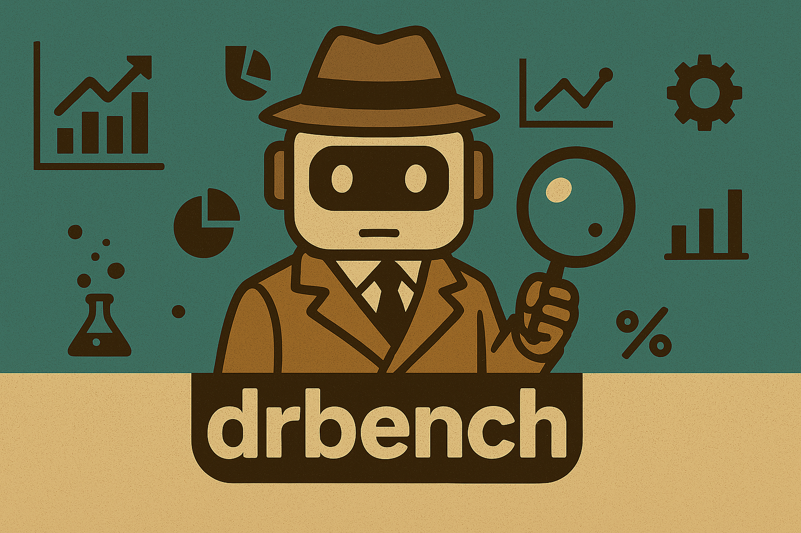

## `DRBench` – The Benchmark for Enterprise Deep Research Agents
### 🚀 Coming Soon 
> ⭐ _**Star & Watch this repo to be notified about the release**_

**`DRBench`** is the first of its kind benchmark designed to evaluate deep research agents on complex, open-ended **enterprise deep research tasks**.

It tests an agent’s ability to conduct **multi-hop, insight-driven research** across public and private data sources—just like a real enterprise analyst.

---

## 🧠 Why `drbench`?

- **🔎 Real Deep Research Tasks**  
  Not simple fact lookups. It has tasks like _"What changes should we make to our product roadmap to ensure compliance?"_ which require multi-step reasoning, synthesis, and reporting.

- **🏢 Enterprise Context Grounding**  
  Each task is rooted in realistic **user personas** (e.g., Product Developer) and **organizational settings** (e.g., ServiceNow), for deep understanding and contextual awareness.

- **🧩 Multi-Modal, Multi-Source Reasoning**  
  Agents must search, retrieve, and reason across:
  - Internal chat logs 💬  
  - Cloud file systems 📂  
  - Spreadsheets 📊  
  - PDFs 📄  
  - Websites 🌐  
  - Emails 📧

- **🧠 Insight-Centric Evaluation**  
  Reports are scored based on whether agents extract the **most critical insights** and **properly cite** their sources.

---

## 📦 What You'll Get

✅ The **first benchmark** for deep research across hybrid enterprise environments  
✅ A suite of **real-world tasks** across Enterprise UseCases like CRM
✅ A **realistic simulated enterprise stack** (chat, docs, email, web, etc.)  
✅ A task generation framework blending **web-based facts** and **local context**  
✅ A **lightweight, scalable evaluation mechanism** for insightfulness and citation

---

## 🧪 Project Status

We’re putting the final polish on the benchmark, evaluation tools, and baseline agents.  
**Public release coming soon!**

---

## 🤝 Get Involved

Interested in early access, collaboration, or feedback?  
- Reach out via [issam.laradji@servicenow.com]
- Join our Discord Channel [https://discord.gg/9rQ6HgBbkd]

---

## 🤝 Core Contributers

- Tianyi Chen – <tianyi.chen@servicenow.com>  
- Miguel Muñoz – <miguel.munoz@servicenow.com>  
- Amirhossein Abaskohi – <amirhossein.abaskohi@servicenow.com>
- Curtis Fox - <curtis.fox@servicenow.com>
- Alex Drioun – <alexandre.drouin@servicenow.com>  
- Issam Laradji – <issam.laradji@servicenow.com>
